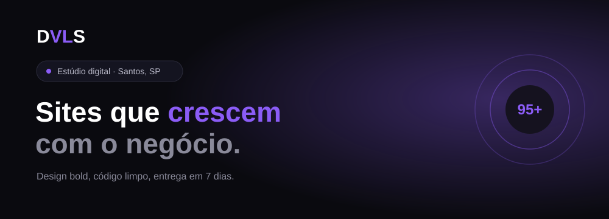

<div align="center">




</div>

<br>

<div align="center">

| ⚡ 95+ | 🚀 7d | 📦 10+ | 🎯 100% |
|:---:|:---:|:---:|:---:|
| Lighthouse | Entrega | Projetos | Custom |

</div>

<br>

<table align="center">
<tr>
<td width="60%" valign="top">

### `> sobre_mim.js`

```js
const luan = {
  studio: "DVLS — Estúdio Digital",
  location: "Santos, SP 🇧🇷",
  stack: ["Next.js", "Node.js", "PostgreSQL", "Tailwind"],
  focus: "Performance obsessiva (Lighthouse 95+)",
  delivery: "7 dias",
  philosophy: "Design bold. Código limpo. Resultado real."
};
```

</td>
<td width="40%" valign="top">

### `> métricas`

<div align="center">

| | |
|---|---|
| ⚡ Lighthouse | **95+** |
| 🚀 Entrega | **7 dias** |
| 📦 Projetos | **10+** |
| 🎯 Custom | **100%** |

</div>

</td>
</tr>
</table>

<br>

<div align="center">

### `> stack`


</div>

<br>

<div align="center">

### `> conecte-se`

<a href="https://dvls.com.br"></a>
<a href="#"></a>
<a href="#"></a>

</div>

<br>

<div align="center">

</div>
